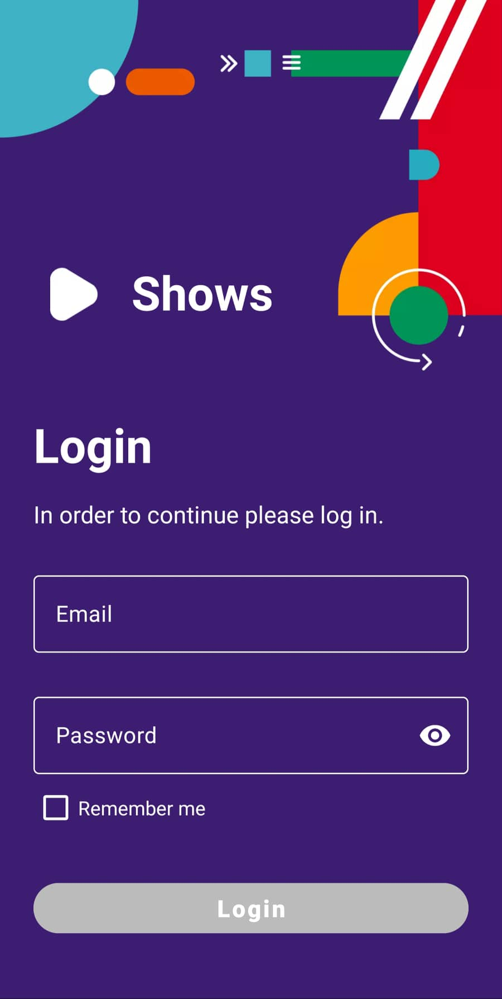
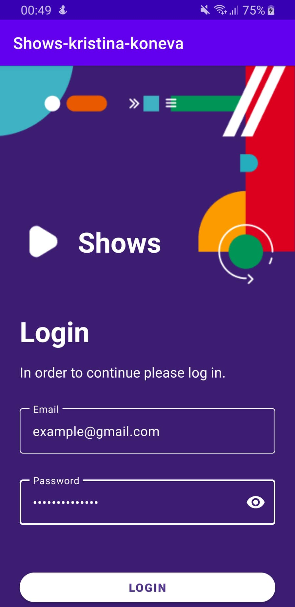
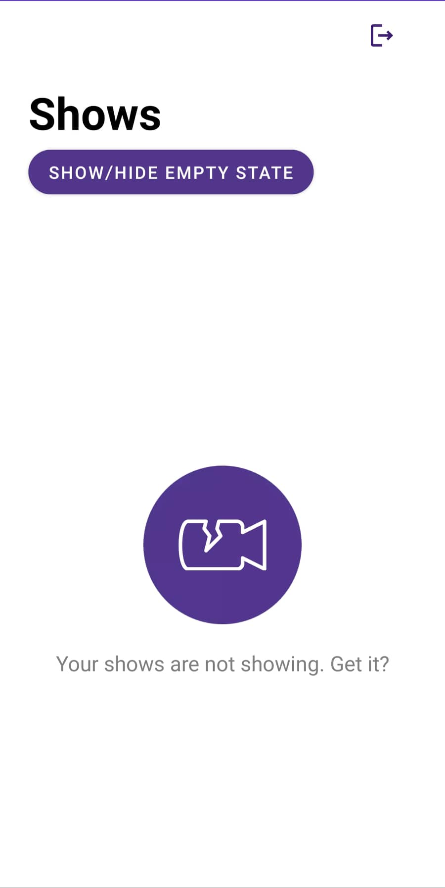
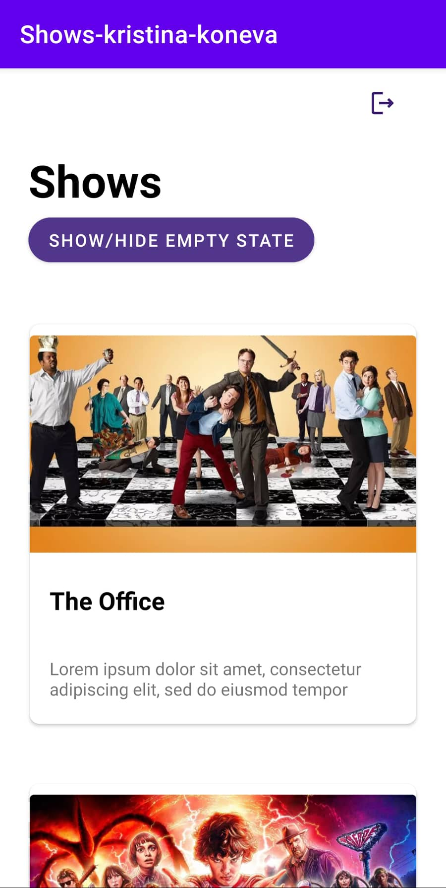
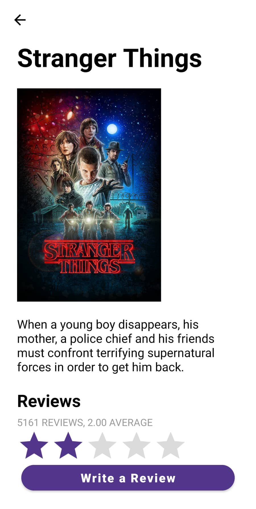
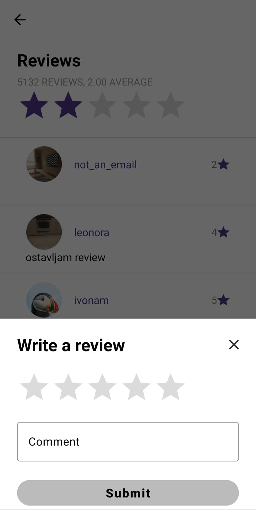
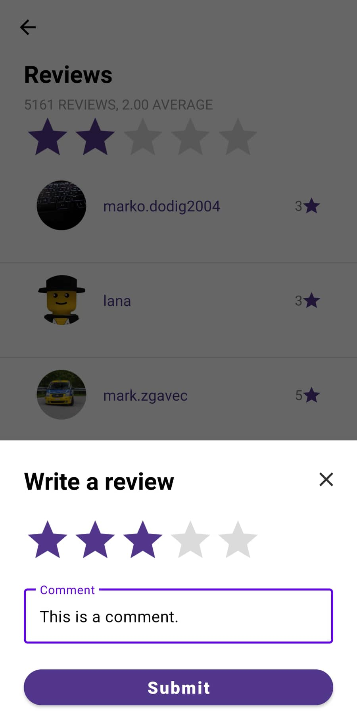
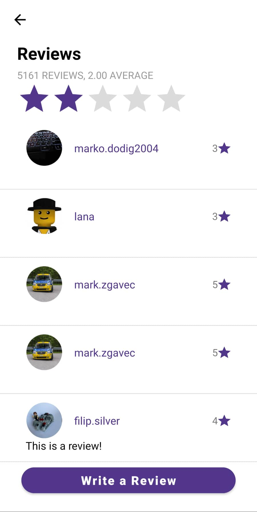

# Shows App - Kristina Koneva
This project represents an Android application
used for listing and watching TV shows which will be developed
during the Infinum Academy Android Course.    
The application will be built using Kotlin as the language of choice,
Android Studio as the official IDE and MVVM as the application architecture.    
Further information about the project will be provided when new features are implemented.

## Login Screen

&nbsp; &nbsp; &nbsp; &nbsp;

The application starts with the login screen where the user is required to enter an email and a password to continue.   
The email and password must be inputted in the correct format, otherwise the LOGIN button is disabled, an error message is displayed and the user cannot continue to the next screen. 
An example of a correct email format is: username@gmail.com and the password must contain at least 6 characters.    
A click on the LOGIN button takes the user to the next screen - the shows screen.

## Shows Screen

&nbsp; &nbsp; &nbsp; &nbsp;

The first image shows the empty state screen and once the SHOW/HIDE EMPTY STATE button is clicked, 
the shows are displayed on the screen as seen on the second image. 
When the user clicks on the SHOW/HIDE EMPTY STATE button several times, 
depending on the previous state, the shows empty state will be shown/hidden accordingly.    
On the top right corner there is a logout button which when clicked, takes the user back to the login screen and requires him to login again.    
If the user click on a show card, a new screen is shown where details about that particular show are displayed.

## Show Details Screen

This Show Details screen appears when a user clicks on a particular show card in the shows list. 
There is a photo and description about the show and at the bottom there is a reviews section which is initially empty. 
When the user clicks on the WRITE A REVIEW button, a bottom sheet dialog is opened, so that the user can enter a review.

## Write a Review Bottom Sheet Dialog

&nbsp; &nbsp; &nbsp; &nbsp;

This bottom sheet dialog is opened once the user clicks on the WRITE A REVIEW button from the Show Details screen.
The review consists of a rating and a comment.
The first image shows how the dialog looks before the user has inputted anything. The SUBMIT button is disabled
as long as the user hasn't given a rating. To be able to submit a review, 
only the rating is mandatory and the comment is optional. The second image shows how the dialog looks once the user has given a rating 
and inputted some text in the comment field which leads to the SUBMIT button becoming enabled.

## Reviews Section

The image above shows how the reviews will be displayed once they are submitted. 
A placeholder profile photo, the username, the rating and the comment are displayed for each review.
On the top of all reviews, a status about them is shown: how many reviews are there and what is the average rating. 
The average rating is additionally represented with a rating bar.