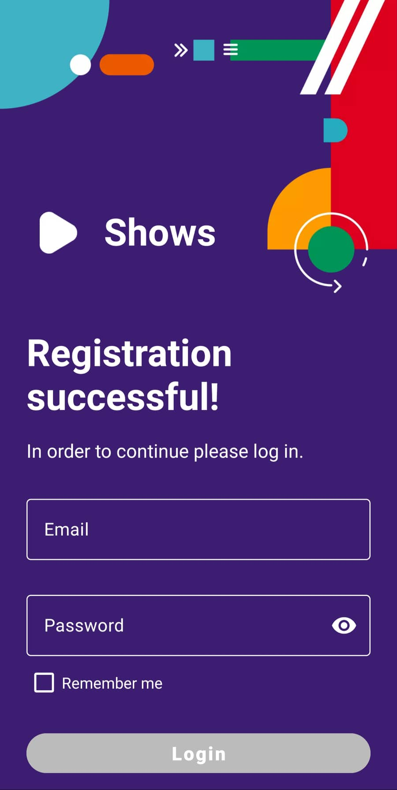
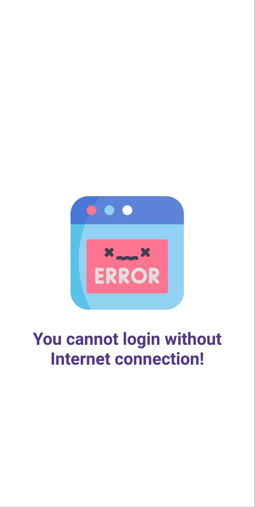
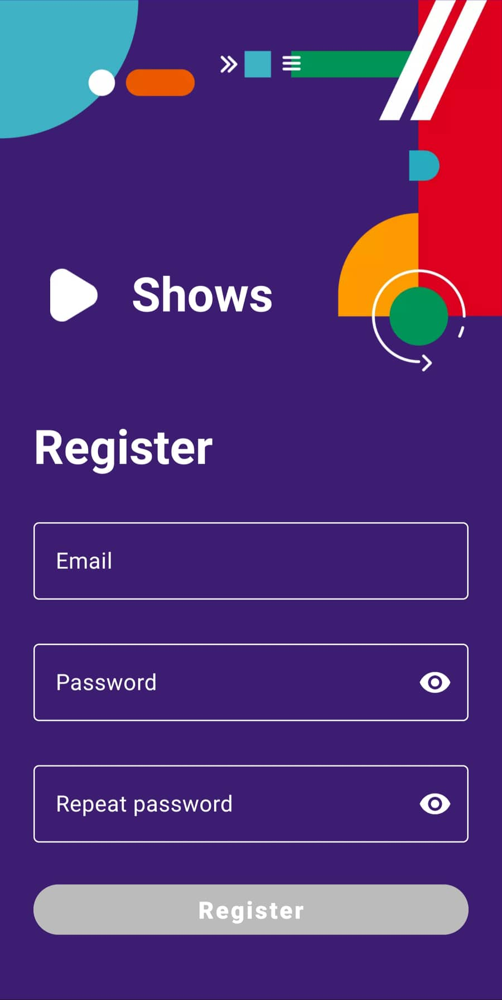
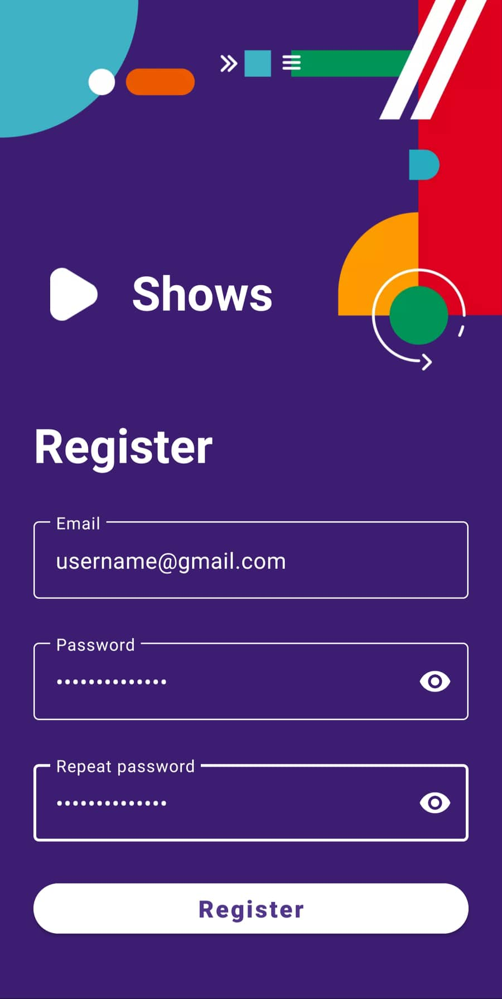
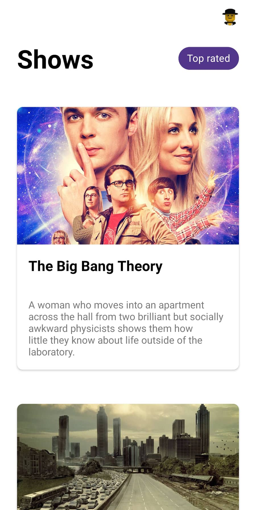
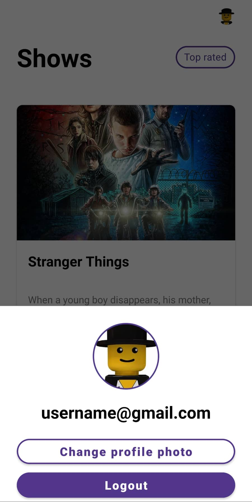
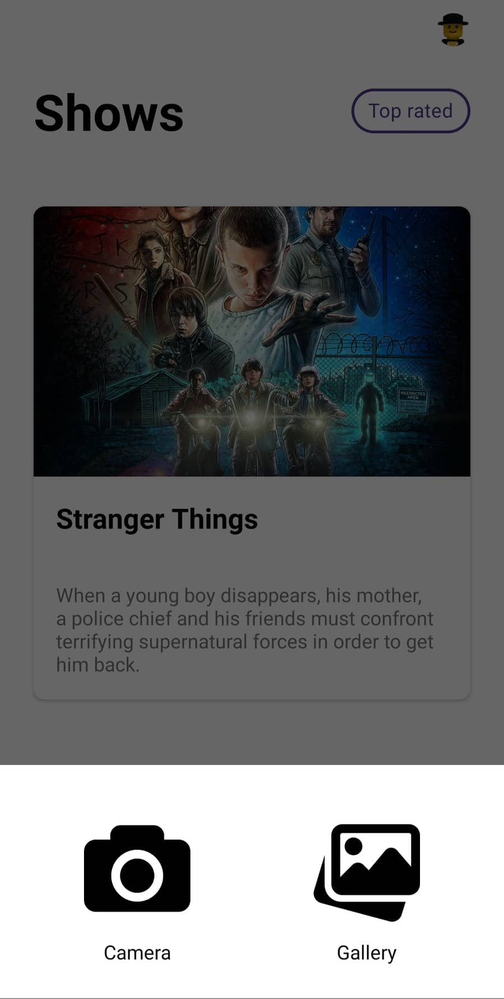
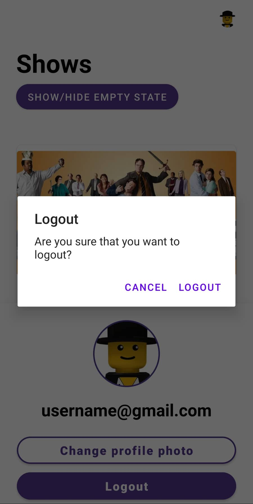

# Shows App - Kristina Koneva
This project represents an Android application
used for listing TV shows which was developed
during the Infinum Academy 2022 Android Course.    
The application is built using 
<a href="https://developer.android.com/kotlin?gclid=Cj0KCQjwuaiXBhCCARIsAKZLt3kUvO79J4zLzxIvRhNSUE0pkQPWleNghyJF8kI6gOdL-aeBUM_STPwaAhYcEALw_wcB&gclsrc=aw.ds" target="_blank">Kotlin</a> as the language of choice,
<a href="https://developer.android.com/studio?gclid=Cj0KCQjwuaiXBhCCARIsAKZLt3nmrYJTmrUlYUZ6NBPX3gBL0N91KPxJ_OsjAjBOMZPZbUhe4VnnYlcaAqrJEALw_wcB&gclsrc=aw.ds" target="_blank">Android Studio</a> 
as the official IDE and MVVM as the application architecture.    
The documentation for the API used in this app is available on the following link: <a href="https://tv-shows.infinum.academy/api/v1/docs/index.html" target="_blank">tv-shows.infinum.academy/api</a>.    
The networking part of this app was done with the help of some libraries, such as:
<a href="https://square.github.io/okhttp/" target="_blank">OkHttp</a>,
<a href="https://square.github.io/retrofit/" target="_blank">Retrofit</a>,
<a href="https://github.com/Kotlin/kotlinx.serialization/blob/master/docs/serialization-guide.md" target="_blank">KotlinX Serialization</a>. 
For simplifying the inspection of HTTP(S) requests/responses fired by the app, <a href="https://github.com/ChuckerTeam/chucker" target="_blank">Chucker</a> was used as an OkHttp Interceptor.    
This app also has a database created with <a href="https://developer.android.com/training/data-storage/room" target="_blank">Room</a>.
When the user is offline, the data from the database is displayed (if the database is empty, an empty state is displayed).    
The <a href="https://coil-kt.github.io/coil/" target="_blank">Coil</a> library is used for loading images into the views.    
More details about which libraries were used and their versions can be seen in the app's build.grade file.    
The Shows App needs permissions for accessing and changing the network state, accessing the Internet, reading from external storage and writing settings.    
In order to have a more dynamic and flexible UI, 
fragments were used to modularise the app in combination with the 
<a href="https://developer.android.com/guide/navigation/navigation-getting-started" target="_blank">Navigation Component</a> for reducing the navigation logic.

## Login Screen

&nbsp; &nbsp; &nbsp; &nbsp;

&nbsp; &nbsp; &nbsp; &nbsp;

The application starts with the login screen where the user is required to enter an email and a password to continue.   
The email and password must be inputted in the correct format, otherwise the Login button is disabled, an error message is displayed and the user cannot continue to the next screen. 
An example of a correct email format is: username@gmail.com and the password must contain at least 6 characters.    
If the user has checked the Remember me checkbox, the next time the user opens the app, 
they will be directly taken to the Shows screen, without the need to log in again.    
If the user logs in successfully, a click on the Login button takes the user to the next screen - the Shows screen.    
If the login fails, the user will be notified with a Toast at the bottom of the screen.    
If the user clicks on the Register button, they will be taken to the Register screen and if they Register successfully, they will be taken back to the Login screen and they will still need to login before they continue. 
The third image shows how the Login screen looks when the user is coming from the Register screen after a successful registration.    
The user must be connected to the Internet in order to login, otherwise this will be displayed:    

## Register screen

&nbsp; &nbsp; &nbsp; &nbsp;

If the user clicks the Register button on the Login screen, this is the screen they will be taken to.   
The first image shows how the Register screen looks before the user has inputted any data and the second image shows 
after the user has inserted correctly formatted information in all of the text input fields.   
In order to register, the user must enter a proper email, a password with at least 6 characters and repeat that password. 
If the user has inputted the data in the correct format, the Register button is enabled, otherwise, an error message is displayed, the Register button 
is disabled and the user cannot continue to the next screen.   
If the user registers successfully, they are taken to the Login screen where it is required from them to login before they start using the app.   
If the registration fails, the user will be notified with a Toast at the bottom of the screen.

## Shows Screen

&nbsp; &nbsp; &nbsp; &nbsp;

&nbsp; &nbsp; &nbsp; &nbsp;

This is the Shows screen where a list of shows is displayed as seen in the first image.    
If the user click on a show card, a new screen is shown where details about that particular show are displayed.    
When the user clicks on the Top rated chip, a list of the top rated shows is displayed as in the second image.    
If the user has no Internet connection and the database is empty, an empty state is displayed.
The design of the empty state screen is shown in the third image.    
On the top right corner, the user's profile photo is shown and when it is clicked, it opens a bottom sheet dialog for changing the profile photo or logging out.    

### Change Profile Photo or Logout Bottom Sheet Dialog
  
In this bottom sheet dialog, the user's profile photo and email are displayed. Below them, there are two button: one for changing the profile photo and one for logging out.    
If the user clicks on the button - Change profile photo, 
a new bottom sheet dialog is opened where the user can choose whether to change the photo 
by taking a photo directly from the Camera app or choose a photo from their gallery. This bottom sheet dialog is shown below:    
  
If the user is not connected to the Internet, they will not be allowed to change their profile photo.   
If the user clicks on the Logout button, an alert dialog will be shown where the user has to confirm their logout:    
   
If the user confirms their logout, they will be taken back to the Login screen.

## Show Details Screen

This Show Details screen appears when a user clicks on a particular show card in the shows list.    
There is a photo and description about the show and at the bottom there is a reviews section.
When the user clicks on the Write a review button, a bottom sheet dialog is opened, so that the user can enter a review.    
On the top of this screen, there is a toolbar with a back button (represented as a back arrow) on it. When the back button is clicked, 
the user is taken back to the Shows screen.

### Write a Review Bottom Sheet Dialog

&nbsp; &nbsp; &nbsp; &nbsp;

This bottom sheet dialog is opened once the user clicks on the Write a review button from the Show Details screen.
The review consists of a rating and a comment.    
The first image shows how the dialog looks before the user has inputted anything. The Submit button is disabled
as long as the user hasn't given a rating. To be able to submit a review, 
only the rating is mandatory and the comment is optional.    
The second image shows how the dialog looks once the user has given a rating 
and inputted some text in the comment field which leads to the Submit button becoming enabled.    
The dialog can be dismissed by clicking somewhere outside the dialog or by clicking the x button on the top right corner of the dialog.

### Reviews Section

The image above shows how the reviews will be displayed.    
The user's profile photo, their username, the rating and the comment they left are displayed for each review.
On the top of all reviews, a status about them is shown: how many reviews are there and what is the average rating calculated from all of them. 
The average rating is additionally represented with a rating bar.    
If there are no reviews about the show, a "No reviews available." message will be displayed.